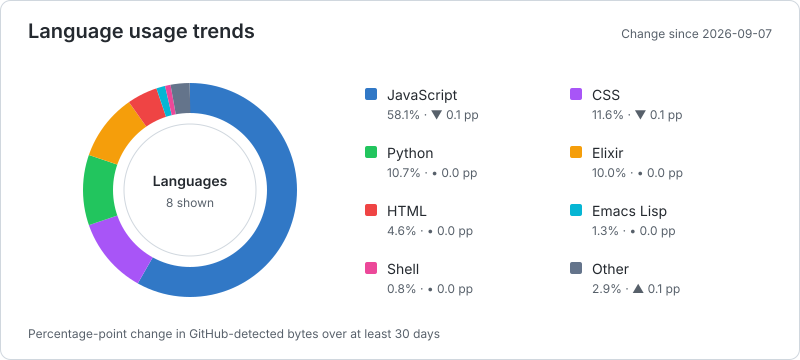
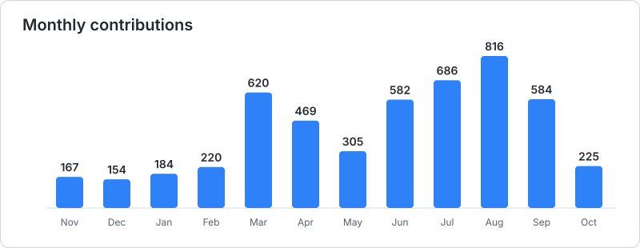
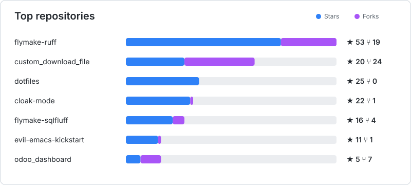

<!-- STATS:START -->
## GitHub at a glance

| Repositories | Active | Stars | Forks |
| ---: | ---: | ---: | ---: |
| 113 | 113 | 228 | 82 |

### Last 12 months

| Commits | Pull requests | Reviews | Issues |
| ---: | ---: | ---: | ---: |
| 3090 | 519 | 1601 | 0 |

**Languages:** JavaScript 57% · CSS 11% · Python 10% · Elixir 9% · HTML 4% · Emacs Lisp 1%

### Charts

  <picture>
    <source media="(prefers-color-scheme: dark)" srcset="generated/languages-dark.svg">
    
  </picture>
  <picture>
    <source media="(prefers-color-scheme: dark)" srcset="generated/monthly-activity-dark.svg">
    
  </picture>

<picture>
  <source media="(prefers-color-scheme: dark)" srcset="generated/repositories-dark.svg">
  
</picture>

### Recently updated projects

| Repository | Stars | Language | Updated |
| --- | ---: | --- | --- |
| [dotfiles](https://github.com/erickgnavar/dotfiles) | 25 | C | 2026-10-10 |
| [naoshi-test](https://github.com/erickgnavar/naoshi-test) | 0 | JavaScript | 2026-10-05 |
| [sanito](https://github.com/erickgnavar/sanito) | 3 | Elixir | 2026-08-21 |
| [exercism](https://github.com/erickgnavar/exercism) | 0 | Haskell | 2026-08-20 |
| [github-profile-readme-stats](https://github.com/erickgnavar/github-profile-readme-stats) | 0 | Python | 2026-08-10 |

_Last updated 2026-10-10 UTC._
<!-- STATS:END -->
